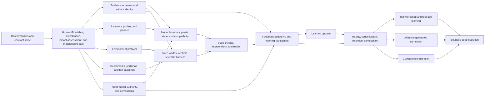

# Development dependency graph

The responsibility tree controls ownership; this graph controls readiness. A node may have one parent and many dependencies. Dependencies never create additional parents.

## Readiness sequence

0. Under `ANG-ADR-0002`, execute only Construction Release 0 leaves needed to build the local evidence/authorization control plane. This temporary `BOOTSTRAP_WORK` path is synthetic, offline, dependency-free, model-free, exactly reversible, and cannot pass the human-flourishing gate, a normal branch technical gate, Slice 00, or M0. The first leaf is EVIDENCE-SCHEMAS; later CR0 leaves may consume it only after the release-scoped, non-equivalent `ANG-GATE-CR0-EVIDENCE-SCAFFOLD-001` records `SCAFFOLD_ACCEPTED` and its exact receipt identity is pinned. The normal `ANG-GATE-EVIDENCE-SCHEMAS-001` remains not run and continues to block ARTIFACT-LINEAGE delivery.
1. Establish the Human-Flourishing Constitution, independent impact contract/gate, root invariants, semantic IDs, contracts, and evidence identities.
2. In parallel, expand:
   - EVIDENCE-SCHEMAS and ARTIFACT-LINEAGE;
   - CAPABILITY-INVENTORY, RESOURCE-PROBES, and EXECUTION-PLANNER;
   - ENVIRONMENT-PROTOCOL;
   - BENCHMARKS, PARTITIONS, and BASELINES;
   - THREAT-MODEL, HUMAN-AUTHORITY, and PERMISSIONS.
3. Build MODEL-BOUNDARY, PLASTIC-STATE, RUNTIME-COMPATIBILITY, and a fixed scientific loop.
4. Prove state save/zero/swap/transfer/restore/replay before enabling updates.
5. Build FEEDBACK-UPDATE and LEARNING-TRANSACTION as the first adaptive slice.
6. Accumulate accepted and rejected transaction evidence before META-UPDATER.
7. Add replay, consolidation, retention, and composition before tools or generated curricula.
8. Add tools, adaptive worlds, migration, and bounded code evolution only at their milestone gates.

## Readiness rule

A Tier-4 work leaf is `ready` only when its parent design is approved, consumed contract versions exist, its acceptance test is predeclared, a proportionate human-impact assessment/gate is mapped, write scope and owner are assigned, the required context packet fits its budget, and rollback is defined.

Design exploration may occur before readiness, but no unready node may mutate the promoted runtime or claim milestone completion.
