# Project Angler responsibility tree

The tree assigns one parent and one accountable outcome to every blueprint. Cross-branch dependencies belong in the interface registry and dependency graph. Implementation order belongs in the integration spine.

```mermaid
flowchart TB
    ROOT[ANG-BP-ROOT<br/>Project Angler]
    ROOT --> SCI[ANG-BP-SCIENCE<br/>Scientific proof]
    ROOT --> RUN[ANG-BP-RUNTIME<br/>Runtime and neural state]
    ROOT --> LEARN[ANG-BP-LEARNING<br/>Plasticity and competence]
    ROOT --> EVID[ANG-BP-EVIDENCE<br/>Evidence and reproducibility]
    ROOT --> RES[ANG-BP-RESOURCES<br/>Resource adaptation]
    ROOT --> WORLD[ANG-BP-WORLDS<br/>Environments and curriculum]
    ROOT --> TOOL[ANG-BP-TOOLS<br/>Capability workshop]
    ROOT --> SAFE[ANG-BP-SAFETY<br/>Human flourishing, safety,<br/>and bounded evolution]

    SCI --> BENCH[Benchmarks and partitions]
    SCI --> BASE[Baselines and fair budgets]
    SCI --> CAUSAL[Causal and adversarial tests]
    SCI --> PROMO[Statistics and promotion]

    RUN --> MODEL[Foundation-model boundary]
    RUN --> STATE[Plastic-state representation]
    RUN --> ACT[Agent runtime]
    RUN --> TX[Learning transaction]

    LEARN --> UPDATE[Feedback update v0]
    LEARN --> REPLAY[Replay selection]
    LEARN --> META[Meta-plastic updater]
    LEARN --> CONS[Consolidation and retention]

    EVID --> SCHEMA[Evidence schemas]
    EVID --> STORE[Append-only store]
    EVID --> LINEAGE[Artifact lineage]
    EVID --> RECOVER[Replay and recovery]

    RES --> PROFILE[Capability inventory]
    RES --> PLAN[Execution planner]
    RES --> PLACE[Placement and replanning]
    RES --> MIGRATE[Competence migration]

    WORLD --> ENV[Environment protocol]
    WORLD --> FIXED[Fixed procedural families]
    WORLD --> VERIFY[Outcome and environment validation]
    WORLD --> CURR[Adaptive curriculum]

    TOOL --> REG[Tool specification and registry]
    TOOL --> SBOX[Sandbox runtime]
    TOOL --> SHOP[Tool workshop]
    TOOL --> TLIFE[Promotion, use, composition]

    SAFE --> THREAT[Threat and trust boundaries]
    SAFE --> AUTH[Human authority and rollback]
    SAFE --> INTAKE[Dependency and recovered-code intake]
    SAFE --> EVOLVE[Bounded code evolution]
```

## Tier-1 branch index

| Blueprint ID | Outcome owner | Design | Delivery | Current gate |
|---|---|---|---|---|
| [`ANG-BP-SCIENCE`](branches/science/BLUEPRINT.md) | Distinguish transferable competence from memory, leakage, or extra compute | approved for CR0 design | ready after predecessors | `ANG-GATE-SCIENCE-DESIGN-001` |
| [`ANG-BP-RUNTIME`](branches/runtime/BLUEPRINT.md) | Execute one frozen substrate with an exact active-state lifecycle and hard promotion authorization | draft rev. 2 | not_started | `ANG-GATE-RUNTIME-DESIGN-001` |
| [`ANG-BP-LEARNING`](branches/learning/BLUEPRINT.md) | Turn experience into bounded transferable competence changes | draft | not_started | `ANG-GATE-LEARNING-DESIGN-001` |
| [`ANG-BP-EVIDENCE`](branches/evidence/BLUEPRINT.md) | Make every update, authorization, and claim attributable and replayable | approved for CR0 design rev. 3 | CR0 schema scaffold accepted; normal gate `NOT_RUN` | ARTIFACT-LINEAGE remains blocked by normal schema delivery |
| [`ANG-BP-RESOURCES`](branches/resources/BLUEPRINT.md) | Adapt execution to available compute without changing scientific meaning | approved for CR0 design | CR0 synthetic scaffold accepted; normal gate `NOT_RUN` | Real probes require successor authority |
| [`ANG-BP-WORLDS`](branches/worlds/BLUEPRINT.md) | Supply controlled experience and bounded outcome feedback | approved for CR0 design | blocked by safety/evidence | `ANG-GATE-WORLDS-DESIGN-001` |
| [`ANG-BP-TOOLS`](branches/tools/BLUEPRINT.md) | Add testable executable capabilities separately from neural promotion | draft | deferred | `ANG-GATE-TOOLS-DESIGN-001` |
| [`ANG-BP-SAFETY`](branches/safety/BLUEPRINT.md) | Enforce human flourishing, containment, supply-chain integrity, and external authority | global draft; CR0 governance approved rev. 2 | CR0 documented | CR0 bootstrap gate passed; full SAFETY/human-flourishing gates open |

## Active expansion frontier

Milestone M0 expands one level beneath every Tier-1 branch, stabilizes the shared interfaces, and activates only the leaves needed for the first four integration slices. Deeper children remain stubs until their parent is approved.

Construction Release 0 is the active pre-M0 frontier. EVIDENCE-SCHEMAS and the synthetic Resources scaffold are independently `SCAFFOLD_ACCEPTED`, historical, and non-repeatable. Active execution is limited to the one-shot documentation-only `ANG-WORK-CR0-CONTINUITY-002@1`; afterward any executable work requires a successor manifest. Normal Evidence, Resources, and Human-Flourishing gates remain `NOT_RUN`; Slice 00 and M0 remain `NOT_PASSED`.
